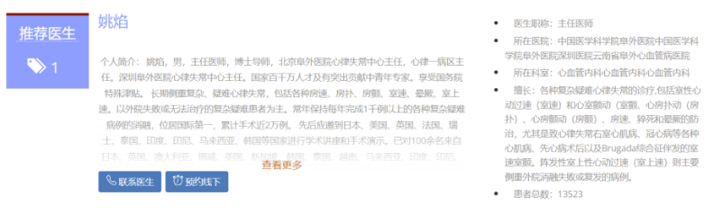

# **基于知识图谱的医生推荐系统**

本项目主要实现了疾病自诊和医生推荐两个功能。疾病自诊主要通过利用BERT+CRF+BiLSTM的医疗实体识别， 建立医学知识图谱，
从而实现基于患者问诊文本的疾病初诊。这个功能帮助患者初步了解自身的疾病情况并为下一步与医生的交流提供支持。
第二个功能是医生推荐。本平台采用基于Jacard距离的Minhash和minhashLSHForest算法来进行推荐，
匹配患者的咨询文本和医生的历史问诊信息，从而为患者推荐最适合的医生。最后我们使用django框架进行项目发布。

## 1.项目框架

## 2.数据采集

本项目除了使用公开的医疗数据集外，还采集了中国领先医疗平台的数据集。

`spiders`模块提供了数据采集的信息。

39crawler用于获取39健康网的数据，hdf用于获取好大夫网的数据（scrapy）。

我们还提供了编译后的代码程序，感兴趣的同学可以通过百度网盘获取。

链接：https://pan.baidu.com/s/149ttC2KJJLA9HJl8YYKkLg 

提取码：3k2v

运行程序在dist文件夹中，双击spider_run.exe即可运行爬虫程序。

爬取指定的疾病信息，在disease.txt加入科室名称（拼音）或者疾病名称（拼音），每一个科室或者科室占据单独一行。

无论你在disease.txt文件中添加多少行，爬虫只会爬取第一行对应的科室或疾病，结果将在程序运行完成后，输出为doctor.csv，disease.csv。

如需爬取第二个疾病，请将第一行科室或者疾病删去，重新运行程序。

## 3.疾病自诊

在疾病自诊模块，平台会读取用户疾病描述的语义信息，首先进行文本预处理，然后通过实体识别模型抽取出其中的关键成分，即：疾病症状、并发症、身体部位等医学实体。然后，这些医学实体会输入到平台后端的知识图谱（基于大规模数据集构建）中。最终，通过知识图谱的快速查询和计算，平台将返回基于患者疾病描述的疾病推断以及相应的概率值。同时，疾病相关的介绍、需要去就诊的科室和疾病多发人群的相关信息也会推送给用户。

### 3.1. 医学实体识别

医疗实体识别是指从给定句子中识别出医疗实体。在本项目中，需要从患者咨询的病情描述中识别出疾病、症状、科室等多种类型的医疗实体，找到与疾病特征相关的关键词。

`entity_extract`模块提供了有关医学实体识别的有关信息。

由于模型过大因此并未放置在项目文件路径下，需要的同学可以通过**百度网盘**获取相关的代码和数据文件：

链接：https://pan.baidu.com/s/1KPTUCe4rN2WtYRiUkoRSMA 

提取码：11dt

~~~~
输入：汪主任您好，1月中旬常规体检发现TCT高度病变，HPV未查，2020年hpv和tct正常。已经在南京鼓楼医院做了活检，报告如下，诊断写的肿瘤，请问现在这个是不是癌呢？是不是很严重？因为娃太小很害怕，后续该怎么手术呢？十分迫切希望得到您的答复，不胜感激！

输出：{'test': [('hpv', 35), ('tct', 39), ('活检', 56)], 'symptom': [('肿瘤', 68)], 'feature': [('严重', 87)]}
~~~~

~~~~
使用示例：
# predict.py
args.bert_dir = '../data/bert-base-chinese'  # 加载预训练的语义模型
model_name = 'bert_bilstm_crf'  # 使用的model类型：bert_bilstm， bert_bilstm_crf， bert_crf， bert
id2query = pickle.load(open('../data/id2query.pkl', 'rb'))  # 加载词典
ent2id_dict = pickle.load(open('../data/ent2id_dict.pkl', 'rb'))  # 加载词典
args.num_tags = len(ent2id_dict)
bertForNer = BertForNer(args, id2query)
model_path = './checkpoints/{}/model.pt'.format(model_name)  # 模型存储路径
model = bert_ner_model.BertNerModel(args)  # 根据参数实例化模型
model, device = trainUtils.load_model_and_parallel(model, args.gpu_ids, model_path)  # 模型加载
model.eval()
raw_text = "汪主任您好，1月中旬常规体检发现TCT高度病变，HPV未查，2020年hpv和tct正常。已经在南京鼓楼医院做了活检，报告如下，诊断写的肿瘤，请问现在这个是不是癌呢？是不是很严重？因为娃太小很害怕，后续该怎么手术呢？十分迫切希望得到您的答复，不胜感激！".strip().replace(
    '(', '（').replace(')', '）').replace('+', '&')  # 患者输入的自述文本
print(raw_text)
bertForNer.predict(raw_text, model, device)  # 识别的医学实体
~~~~

### 3.2. 支持识别的实体类型

~~~~
body：患病部位，如：胃，皮肤
drug ：药品，如：产妇康清洗液
feature：患病程度，如：严重
disease：疾病，如：前列腺炎
symptom：疾病症状，如：胃壁增厚
department：科室，如：五官科
test：疾病相关的检查，如：血常规
~~~~

### 3.3. 模型选择

我们在训练集上检验了BERT、BERT+CRF、BERT+BiLSTM和BERT+BiLSTM+CRF各模型的准确率、召回率和micro_f1值后，我们发现BERT+BiLSTM+CRF模型具有更好的医疗实体识别能力，因此，在本项目中，我们选用`**BERT+BiLSTM +CRF**`模型完成后续医疗实体识别的任务。

### 3.4. 知识图谱构建

为了进行准确的疾病诊断，我们依托于大规模数据集构建知识图谱。

`build_kg`模块提供了有关知识图谱构建的信息。

我们将应用于疾病自诊这一模块的所需实体标记为诊断检查项目、科室、疾病、药品、患病的部位、疾病症状、患病程度，在用户输入一段文本后，我们首先通过实体识别将以上这些关键实体识别出来。

通过事先考察，我们发现在进行疾病诊断的过程中，不仅仅是以身体的症状为依据，也有许多其他的所属关系可供我们参考。因此在进行关系抽取中，我们将各个实体间的关系分为8类，分别为属于、疾病常用药品、疾病对应科室、疾病别名、疾病所需检查、疾病部位、疾病症状、疾病并发疾病。我们通过以上8类关系判断在知识图谱中实体间两两之间的关系，从而计算出患该种疾病的概率。定义知识图谱实体间关系的描述性统计特征如下表所示。

## 4. 医生推荐

在医生推荐模块，平台期望寻找到历史数据中与用户最相似的患者，并找到与之对应到相应的医生，来完成个性化的推荐。具体而言，平台首先通过用户的描述文本获得其中的医学实体，即：一段文本到多个token的映射。然后，将每一个实体都采用词向量的形式进行表示。紧接着，Minihash和MinihashLSHForest算法连接了两端，即：用户的描述文本和数据库中医生的历史问诊记录。平台使用jacard距离来计算二者的相似性，相似度高的被认为有较高的匹配度。最后，平台通过匹配度较高的问诊记录来推荐医生。

`recommend`模块提供了有关知识图谱构建的信息。

~~~~
输入：一周前稍感胸闷，入院检查，心脏彩超，腹部彩超正常，心脏冠状动脉CT，显示狭窄

输出：[{'Unnamed: 0': 0, 'patient_score': 11, 'patient_online': 2116, 'educate': '教授', 'articleCount': '22篇', 'spaceRepliedCount': '2116位', 'totaldiagnosis': '367位', 'openSpaceTime': '2008-10-22 18:15', 'hot_num': 3.6, 'hospitalName': '上海交通大学医学院附属上海儿童医学中心', 'keshi': '心内科', 'good_at': '先天性心脏病的诊断和介入治疗，小儿肺动脉高压的诊治，儿童心肌病的诊断和治疗', 'introduction': '傅立军，男，主任医师，教授，医学博士，博士生导师，心内科主任，国家卫计委先天性心脏病介入培训基地导师。从事小儿心血管疾病的诊疗二十年，尤其擅长于先天性心脏病的诊断和介入治疗以及肺动脉高压、心肌病的诊治，累计完成先天性心脏病介入治疗3000余例。 中华医学会儿科学分会心血管病学组委员，遗传代谢性心肌病协作组组长 中华医学会心血管病学分会肺血管病学组委员 中国医师协会儿科医师分会心血管疾病专业委员会委员兼秘书长 上海市儿科学会心血管病学组副组长 在国内外发表论文三十余篇。 参编专著多部。', 'doctor_title': '主任医师', 'doctor_id': 221603, 'doctorName': '傅立军', 'disease': 'gaoxueya'}, {'Unnamed: 0': 0, 'patient_score': 71, 'patient_online': 8515, 'educate': '教授', 'articleCount': '8篇', 'spaceRepliedCount': '8515位', 'totaldiagnosis': '1357位', 'openSpaceTime': '2009-05-07 16:16', 'hot_num': 4.0, 'hospitalName': '首都医科大学附属北京安贞医院鹤壁市人民医院', 'keshi': '心脏内科中心心血管内科', 'good_at': '冠心病，介入治疗；心肌病，心力衰竭，难治性高血压的诊断治疗。', 'introduction': '赵全明，博士，首都医科大学教授，博士研究生导师，北京安贞医院心脏内科中心主任医师。1989年西安医科大学内科硕士毕业，1997年底法国路易斯巴斯德大学医学院博士毕业，2000年晋升主任医师。擅长各种心血管疾病的诊断和治疗，重点从事冠心病的临床和研究，个人完成冠状动脉造影10000例，冠心病介入治疗（PCI）超过5000例。开展了冠心病诊断（冠脉造影，血管内超声-IVUS,光学相干断层显像-OCT，冠脉血流储备分数-FFR）和复杂冠心病介入治疗的各种新技术（冠状动脉支架术，钙化病变的旋磨术，支架内再狭窄的药物球囊治疗，生物可降解支架临床研究），并获得丰富经验。', 'doctor_title': '主任医师', 'doctor_id': 4269, 'doctorName': '赵全明', 'disease': 'gaoxueya'}, {'Unnamed: 0': 0, 'patient_score': 13, 'patient_online': 14327, 'educate': '教授', 'articleCount': '95篇', 'spaceRepliedCount': '14327位', 'totaldiagnosis': '3385位', 'openSpaceTime': '2011-07-06 14:35', 'hot_num': 3.6, 'hospitalName': '首都医科大学附属北京安贞医院', 'keshi': '心脏内科中心', 'good_at': '房颤和复杂心律失常的导管消融治疗，尤其擅长各种类型心房颤动（房颤）、心房扑动（房扑）、房性心动过速（房速）的导管消融，包括心脏外科术后如二尖瓣置换术后、房间隔封堵术后以及射频消融术后复发的房颤、房扑；室性心动过速（室速）和室上性心动过速（室上速）；瓣膜病的球囊扩张术，特别是风湿性心脏病二尖瓣狭窄的治疗。', 'introduction': '马长生，主任医师，教授，博士生导师。于1998年完成国内首例房颤导管消融术，并系统建立了我国心律失常消融的技术和方法。 北京市心血管疾病防治办公室主任 中华医学会心血管病学分会副主任委员 中国医师协会心血管内科医师分会会长 中华医学会心电生理和起搏分会副主任委员 中国生物医学工程学会常务理事兼心律分会主任委员 中国生物医学工程学会介入医学工程分会主任委员 为卫生部有突出贡献中青年专家、科技北京百名领军人才、北京市卫生系统领军人才及JournalofCardiovascularElectrophysiology、Europace、JournalofInterventionalCardiacElectrophysiology和ChineseMedicalJournal等30余种学术期刊编委。 3次获国家科学技术进步二等奖 首创单导管法、“2C3L”术式、倒U形导管塑形消融右侧旁路等一系列原创性方法。 牵头研制成功自主知识产权的磁定位三维电解剖标测系统和首套房颤导管消融模拟器。 主编的《介入心脏病学》《心律失常射频消融图谱》为本专业最具影响的教科书之一。 以第一作者或通信作者发表SCI收录论文80余篇， 承担“十二五”国家科技支撑计划、“十二五”国家科技重大专项子课题、“十一五”863计划、“十五”国家科技攻关项目等省部级以上课题数十项。 已授权或公告专利7项，其中PCT专利2项。', 'doctor_title': '主任医师', 'doctor_id': 4255, 'doctorName': '马长生', 'disease': 'gaoxueya'}, {'Unnamed: 0': 0, 'patient_score': 0, 'patient_online': 3151, 'educate': '教授', 'articleCount': '4篇', 'spaceRepliedCount': '3151位', 'totaldiagnosis': '115位', 'openSpaceTime': '2008-12-20 03:09', 'hot_num': 3.5, 'hospitalName': '中国医学科学院阜外医院中国医学科学院阜外医院深圳医院', 'keshi': '心血管内科心血管内科', 'good_at': '冠心病的诊断与介入治疗，急性心肌梗死介入治疗', 'introduction': '主任医师，教授，博士研究生导师 中国医学科学院阜外医院深圳医院内科管委会主任 内科教研室主任、冠心病中心主任、介入中心主任 美国心脏病学会会员（FACC）、美国心脏协会会员（FAHA）；欧洲心脏病学会会员（FESC）。  著名的心血管病学专家，国家级领军人才 中央保健委会诊专家 深圳市医学重点学科（心血管内科）负责人 深圳市重大疾病（冠心病）防治中心负责人 深圳市医防融合心血管病项目专家组组长 深圳市医疗卫生三名工程急性冠脉综合征团队负责人  受教育经历： 1982年武汉大学医学部获学士学位（改革开放后首批本科生）；1988年华中科大同济医学院（全日制）硕士学位；1994年日本国立滨松医大（全日制）博士学位。  专业特长： 全球心血管介入手术例数最多和经验最丰富的的专家之一；各种心血管急重症的诊断与治疗；复杂冠心病介入治疗和长期管理；研究方向：急性心梗临床与转化医学研究。  工作语言： 普通话、英语和日语 中国医师协会胸痛专业委员会副主任委员 《中国介入心脏病学杂志》副主编 《中华心血管病杂志》等编委 《中华医学杂志》等审稿专家 先后建立了中日友好医院、北京安贞医院和北京阜外医院急性心梗救治通道；先后承担国家和省部级研究项目30项，共获得6000万元基金支持。 发表或参与发表文章550篇（https://scholar.google.com/scholar?hl=en&as_sdt=0%2C5&q=HONGBING+YANBeijing+&btnG=）。 出版著（译）作60部（https://book.jd.com/writer/颜红兵_1.html?stop=1&book=y&vt=2）。', 'doctor_title': '主任医师', 'doctor_id': 4274, 'doctorName': '颜红兵', 'disease': 'gaoxueya'}, {'Unnamed: 0': 0, 'patient_score': 4, 'patient_online': 4829, 'educate': '教授', 'articleCount': '33篇', 'spaceRepliedCount': '4829位', 'totaldiagnosis': '1228位', 'openSpaceTime': '2009-08-31 10:21', 'hot_num': 3.6, 'hospitalName': '首都医科大学附属北京安贞医院', 'keshi': '心脏内科中心', 'good_at': '冠心病介入治疗（支架术） 心绞痛/心肌梗死诊治 起搏器／除颤器植入 经导管主动脉瓣置入术 肺动脉高压诊治', 'introduction': '聂绍平，男，教授、主任医师、医学博士、博士研究生导师、欧洲心脏病学会专家会员（FESC），美国心血管造影和介入学会国际会员（FSCAI）。现任首都医科大学附属北京安贞医院急诊危重症中心主任。主要从事冠心病介入治疗、心肺血管急危重症临床与研究工作。个人累计完成经皮冠状动脉介入治疗（支架术）达15000余例，擅长复杂冠心病介入治疗（如钙化病变旋磨术、闭塞病变介入治疗等）。 主持863项目一项，国家自然科学基金面上项目3项，以及多项省部级重点项目。', 'doctor_title': '主任医师', 'doctor_id': 4264, 'doctorName': '聂绍平', 'disease': 'gaoxueya'}]
~~~~

~~~~
运行示例：
# try_minhash.py
df_csv = pd.read_csv('./gaoxueya-1.csv')
# 建立参数
# Number of Permutations
permutations = 128
forest = get_forest(df_csv, permutations)
# Number of Recommendations to return
# 召回top—n数目
num_recommendations = 100
# 精确需要的医生id数
num_doctors = 5
# 输入测试文本
raw_text = ' 一周前稍感胸闷，入院检查，心脏彩超，腹部彩超正常，心脏冠状动脉CT，显示狭窄 '
raw_text = raw_text.strip().replace('(', '（').replace(')', '）').replace('+', '&')
# 模型加载
args.bert_dir = '../data/bert-base-chinese'
model_name = 'bert_bilstm_crf'  # 使用的model类型：bert_bilstm， bert_bilstm_crf， bert_crf， bert
id2query = pickle.load(open('../data/id2query.pkl', 'rb'))
ent2id_dict = pickle.load(open('../data/ent2id_dict.pkl', 'rb'))
args.num_tags = len(ent2id_dict)
bertForNer = BertForNer(args, id2query)
model_path = '../entity_extract/checkpoints/{}/model.pt'.format(model_name)
model = bert_ner_model.BertNerModel(args)
model, device = trainUtils.load_model_and_parallel(model, args.gpu_ids, model_path)
model.eval()
# 识别测试文本中的医疗实体
text_shiti = path_pre(raw_text, bertForNer, model, device)
# 推荐医生
df = pd.read_csv('./haodaifu/doctors_gaoxueya.csv')
recommend(df_csv, text_shiti,df)
~~~~

## 5.项目发布

本项目的运行依托django框架。

`web_server`模块提供了有关平台运行的信息。

### 5.1. 平台首页

### 5.2. 疾病自诊

### 5.3. 医生推荐

